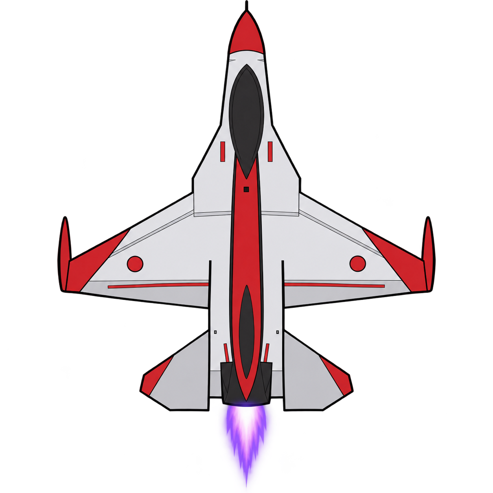
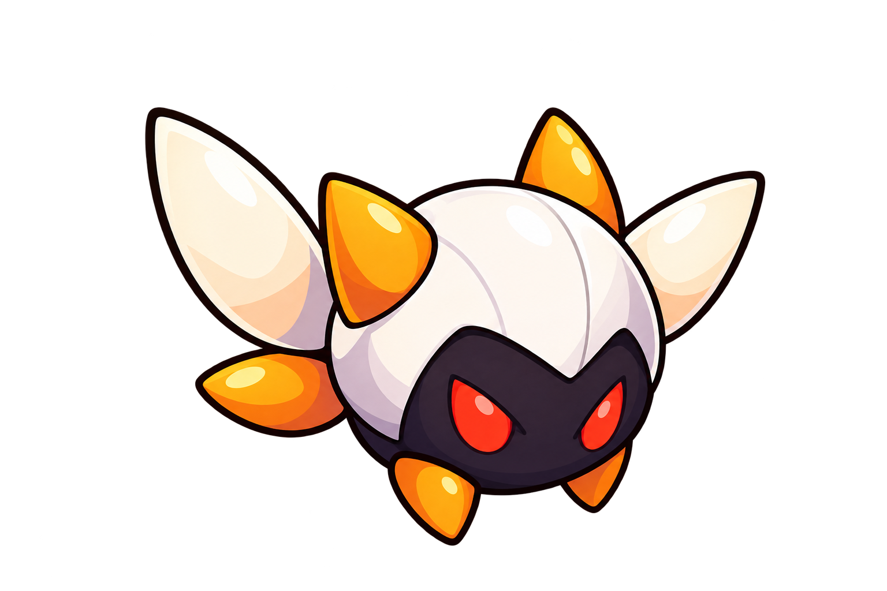

# [게임 기획서] 파이터 젯

**작성자:** 권민기  
**학번:** 26031005  
**작성일:** 2026-08-31  
**업데이트:** 2026-09-16  
**과제명:** 4주차 — 게임 완성 및 최종 제출

---

## 1. 게임 개요
다가오는 몬스터들을 피하거나 총으로 처치하며 생존하는 **종스크롤 탑다운 슈팅 게임**입니다.  
전투기는 화면 아래쪽에서 좌우상하로 이동하며 회피 기동을 하고, 자동으로 발사되는 총알로 몬스터를 처치합니다.

## 2. 게임 목적
**5분간 생존**하면서 몬스터를 처치해 최대한 높은 점수를 획득하는 것이 목표입니다.

## 3. 조작 방법
| 구분 | 입력 방식 | 설명 |
| :--- | :--- | :--- |
| **이동** | 방향키 (`↑`, `↓`, `←`, `→`) | 전투기를 상하좌우로 이동 |
| **공격** | 자동 발사 | 별도 입력 없이 일정 주기로 양쪽 날개에서 총알 발사 (조작 단순화) |
| **시작 / 재시작** | `Spacebar` | 시작 화면과 결과 화면에서 게임 시작·재시작 |

## 4. 게임 규칙
* **HP(생명력) 시스템:**
  * 100에서 시작하며, 몬스터와 충돌할 때마다 10씩 감소합니다.
  * HP가 0이 되면 즉시 **게임 오버(패배)**로 처리됩니다.
* **무적 시간:** 충돌 즉시 연속으로 HP가 깎이지 않도록 충돌 후 1초간 무적 시간을 부여합니다.
* **몬스터 HP:** 몬스터는 총알 3발을 맞으면 처치됩니다.
* **아이템:** 아이템은 사용하지 않습니다 (순수 슈팅 + 회피 스코프).

## 5. 점수 / 승부 규칙
* **몬스터 처치 점수:** 몬스터 1마리 처치당 100점 획득
* **최종 점수:** 게임 종료 시점까지 누적된 처치 점수 합계
* 게임 종료 시 최종 점수를 결과 화면에 표시합니다.

## 6. 게임 시작 조건
프로그램 실행 후 타이틀 화면(게임 제목 + 안내 문구)이 표시되며, `Spacebar` 입력 시 플레이 화면으로 전환되어 게임이 시작됩니다.

## 7. 게임 종료 조건
* **승리:** HP가 0이 되지 않은 채 **5분간 생존** 성공
* **패배:** HP가 0이 됨 (몬스터와 **10회 충돌**)
> 두 조건 중 하나를 만족하면 즉시 게임이 종료되고 결과(점수) 화면으로 전환됩니다. 결과 화면에서 `Spacebar`를 누르면 게임이 재시작됩니다.

## 8. 플레이어 행동
* **이동:** 방향키 입력에 따라 상하좌우로 이동 (화면 경계를 벗어나지 않음)
* **공격:** 양쪽 날개에서 자동으로 총알을 일정 주기마다 발사
* **피격:** 몬스터와 충돌 시 HP 10 감소 + 1초 무적 시간 부여 (무적 중 깜빡임 연출)

## 9. 적 / 장애물 / 아이템 행동
* **몬스터 (Monster):**
  * 화면 위쪽 랜덤한 위치에서 스폰되어 아래(플레이어 방향)로 이동합니다.
  * 총알 3발에 맞으면 소멸하고 처치 점수(100점)를 지급합니다.
  * 화면 아래 끝까지 도달하거나 플레이어와 충돌하면 소멸합니다.
* **아이템:** 미사용 (해당 없음)

## 10. 게임 화면 구성
1. **상단 HUD:** 왼쪽 HP, 정중앙 남은 시간(mm:ss), 오른쪽 점수 표시
2. **중앙 플레이 필드:** 전투기, 몬스터, 총알이 배치되는 영역 (9:16 세로 화면)
3. **타이틀 화면:** 게임 제목("Fighter Jet") + 시작 안내 문구
4. **결과 화면:** 생존 성공(초록색) / GAME OVER(빨간색) 여부 + 최종 점수 + 재시작 안내 문구

## 11. 게임 진행 흐름
```text
[타이틀 화면]
      │ (시작 입력: Space)
      ▼
[플레이 화면 진입] ─── (이동 / 자동사격 / 충돌판정 반복)
      │
      ├───────────────────────────────┐
      ▼                               ▼
[승리: 5분 생존 성공]            [패배: HP 0 (10회 충돌)]
      │                               │
      └───────────────┬───────────────┘
                      ▼
               [결과 화면] (최종 점수 표시)
                      │
              (Space 입력 시 재시작)
```

## 12. 주요 게임 객체 목록
* `Player`: 전투기, 이동 및 발사 담당
* `Bullet`: 플레이어가 발사하는 총알 (오브젝트 풀링)
* `Monster`: 위에서 하강하는 적 (오브젝트 풀링)
* `GameMain`: 게임 전체 상태(시작/플레이/게임오버), 점수, 생존시간, HUD, 결과 화면을 총괄 관리

## 13. 프로그램 클래스 구성

### 클래스 목록 및 관계

```
GameMain (G2AppBase 상속)
├─ Player
├─ Bullet (여러 개, 풀링 관리)
└─ Monster (여러 개, 풀링 관리)
```

`GameMain`이 게임 전체 상태(Start/Playing/GameOver)와 흐름을 관리하며, `Player`, `Bullet`, `Monster` 객체를 생성·갱신·렌더링·해제한다.

### 클래스별 역할

**GameMain**
- 게임 전체 흐름(스타트 화면 → 플레이 → 게임오버) 관리
- 입력 처리, 충돌 판정, 점수/타이머 관리
- 주요 멤버 변수: `_currentState`, `_score`, `_playTimer`, `_isSurvived`, `_bullets`, `_monsters`
- 주요 멤버 함수: `Initialize()`, `Update()`, `Render()`, `StartGame()`, `HandleCollisions()`

**Player**
- 전투기(플레이어) 이동, 자동 발사, HP/무적 관리
- 주요 멤버 변수: `X`, `Y`, `CurrentHP`, `MaxHP`, `IsInvincible`
- 주요 멤버 함수: `Initialize()`, `Update()`, `Render()`, `OnHitByMonster()`, `Reset()`
- 이벤트: `OnFireBullet`(총알 발사 시), `OnDied`(HP 0 시)

**Bullet**
- 플레이어 총알의 이동과 활성 상태 관리 (오브젝트 풀링)
- 주요 멤버 변수: `X`, `Y`, `Active`, `Speed`
- 주요 멤버 함수: `Fire()`, `Update()`, `Render()`, `Deactivate()`

**Monster**
- 적 몬스터의 스폰, 이동, HP, 사망 판정 (오브젝트 풀링)
- 주요 멤버 변수: `X`, `Y`, `CurrentHP`, `MaxHP`, `Active`
- 주요 멤버 함수: `Spawn()`, `Update()`, `Render()`, `TakeDamage()`, `Kill()`

### 객체 생성 및 관리 방법

- `Player`는 `GameMain.Initialize()`에서 1개 생성, 게임 재시작 시 `Reset()`으로 재사용
- `Bullet`, `Monster`는 `Initialize()`에서 미리 여러 개(풀) 생성해두고, 필요할 때 비활성 객체를 꺼내 재사용하는 오브젝트 풀링 방식 사용
- 텍스처(`G2Texture`)는 종류별로 한 번만 로드해서 같은 종류의 객체끼리 공유

### 게임 상태 관리 위치

- `GameMain` 내부 `GameState` enum(`Start`, `Playing`, `GameOver`)으로 관리
- `Update()`/`Render()`에서 현재 상태에 따라 분기 처리

## 14. 이미지 리소스 목록
* 전투기(플레이어) 스프라이트 
* 몬스터(적) 스프라이트 
* 총알 스프라이트 

## 15. 사운드 리소스 목록
* **발사 사운드:** 총알을 쏠 때마다 재생
* **몬스터 피격 사운드:** 총알이 몬스터에 명중할 때마다 재생
* **플레이어 피격 사운드:** 몬스터와 충돌해 HP가 감소할 때 재생
* **게임 오버 사운드:** 플레이어 HP가 0이 되어 패배할 때 재생
* **배경음(BGM):** 미사용

리소스 출처 및 라이선스는 `ResourceList.md` 참고.

## 16. 제작 범위 메모
* 위 규칙과 클래스 구조를 4주차 최종 C# 코드에 모두 반영해 완성했습니다.
* `GameMain`, `Player`, `Bullet`, `Monster` 클래스로 핵심 기능(이동, 자동 발사, 충돌 판정, 점수, 상태 전환, 재시작)을 구현했습니다.
* 아이템, 웨이브 패턴 다양화, 배경음(BGM)은 기획 단계에서 제외하고 진행했습니다.